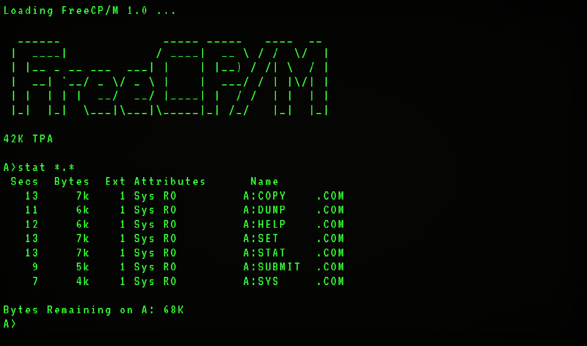

<div align="center">

# FreeCP/M

**A CP/M-inspired operating system**

[](https://mazin-o3.github.io/vemu/)
[](LICENSE)



</div>

## Quick Start

FreeCP/M requires a RISC-V bare-metal toolchain (`riscv64-unknown-elf-gcc` + binutils), `make`, and `sh`.

```sh
make -C sysgen
./sysgen/build/sysgen new --disk-size=2048K --mem=64K --platform=vemu --march=rv32im
```

Everything outputs directly to `sysgen/build/`:

| File | Purpose |
| --- | --- |
| `disk.img` | Final disk image |
| `bootloader.bin` | Boot image |
| `core/int/kernel.bin` | kernel binary |
| `core/int/ccp.bin` | Console Command Processor (CCP) binary |
| `apps/` | Bundled Apps |

To clean up the build environment, run:

```sh
make -C sysgen clean
```

See the [User Guide](docs/user-guide.md) for the full build and execution walkthrough.

---

## The Sysgen Tool

`sysgen` is the host utility for building and inspecting FreeCP/M disk images. Commands other than `new` support appending `--disk=path` to target a specific image; `new` always writes to `sysgen/build/disk.img`.

| Command | Description |
| --- | --- |
| `new --disk-size=KBK --mem=KBK --platform=NAME --march=isa` | Build the OS and create a disk image (the disk is divided into 1 KB blocks; `--disk-size` is capped at the useful maximum: 4 volumes × 2 MB) |
| `add <file> [--dst=Vn] [--attr=R/W\|R/O\|SYS]` | Add an external file to an image |
| `install <folder> [--dst=Vn] [--attr=...]` | Compile a source folder and install the binaries |
| `dir [Vn]` | List files on a volume |
| `type <name> [Vn]` | Print a file |
| `era <name> [Vn]` | Delete a file |
| `ren <old> <new> [Vn]` | Rename a file |
| `stat` | Show volume usage and metadata |

Platforms are defined in `platform/<name>/bios.c`.

See the [Developer Guide](docs/developer-guide.md) to add your own.

---

### CCP Navigation

Switch volumes using `A:`, `B:`, `C:`, or `D:`. Switch user areas with `USER n`.

Filespecs follow CP/M 2.2 syntax: `[d:]name[.type]`. A user digit is accepted
only in two places: the destination of `COPY` (e.g. `COPY F.TXT D7:`) and when
running a program from another volume/user area (e.g. `B0:PROG`).

Type `help` at the command prompt for the full list of commands.

## Architecture

FreeCP/M is structured to isolate user applications from the host hardware, with the Console Command Processor (CCP) and user applications sharing the `Transient Program Area (TPA)`.


## Boot Process


## Documentation Library

| Document | Description |
| --- | --- |
| [User Guide](docs/user-guide.md) | Build, run, and get started |
| [CCP Reference](docs/ccp-reference.md) | Console Command Processor guide |
| [Disk Format](docs/disk-format.md) | FreeCP/M disk image layout |
| [Syscall Reference](docs/syscall-reference.md) | Complete syscall API and ABI specifications |
| [Bundled Apps](docs/bundled-apps.md) | Auto-installed programs |
| [Developer Guide](docs/developer-guide.md) | SDK usage, compiling applications, and adding platforms |

---


## License

FreeCP/M is distributed under the terms of the open-source [MIT](LICENSE).