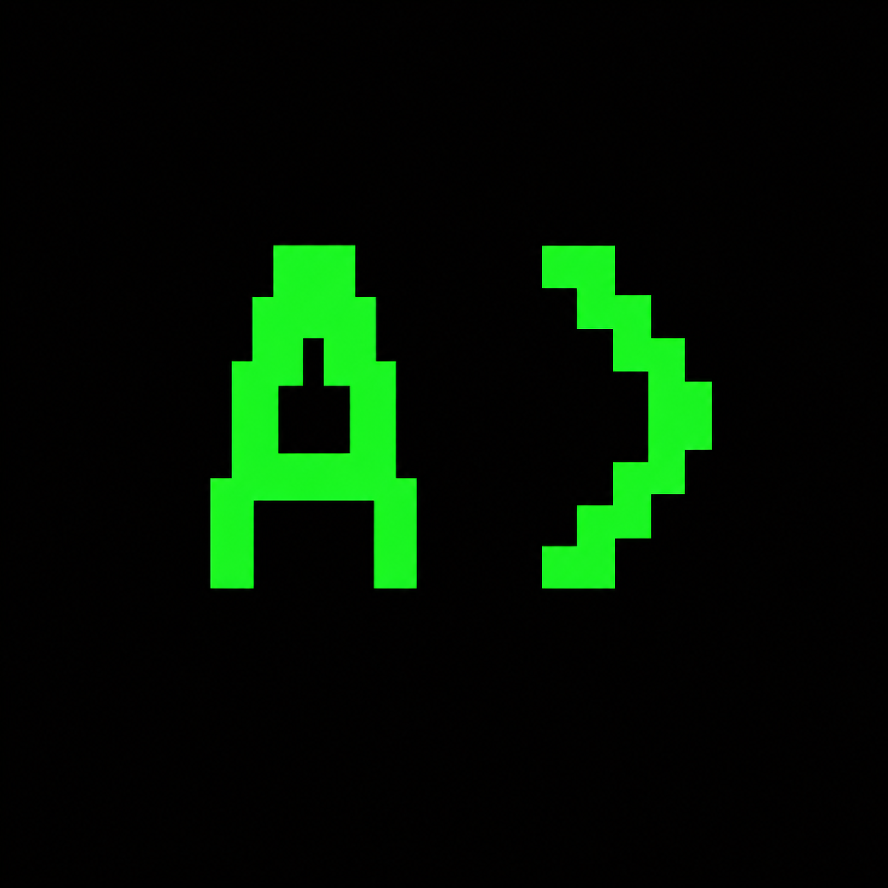
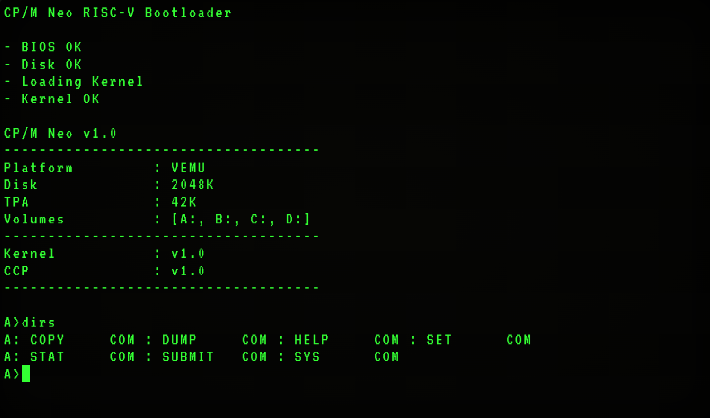

<div align="center">

<picture>
  
</picture>

<h1>CP/M Neo</h1>

<em> A CP/M-inspired operating system </em>

[](https://mazin-o3.github.io/vemu/)
[](https://github.com/Mazin-O3/cpm-neo)
[](https://github.com/Mazin-O3/cpm-neo)
[](https://github.com/Mazin-O3/cpm-neo)
[](LICENSE)




</div>

## Quick Start

CP/M Neo requires a bare-metal cross-compiler toolchain for your target architecture (`arch/<isa>/config.sh` supplies the toolchain prefix and flags), `make`, and `sh`.

```sh
make -C sysgen
./sysgen/build/sysgen new --disk-size=2048K --platform=vemu
```

Everything outputs directly to `sysgen/build/`:

| File | Purpose |
| --- | --- |
| `disk.img` | Final disk image |
| `bootloader.bin` | Boot image |
| `core/int/kernel.bin` | kernel binary |
| `core/int/ccp.bin` | Console Command Processor (CCP) binary |
| `apps/` | Bundled Apps |

To clean up the build environment, run:

```sh
make -C sysgen clean
```

See the [User Guide](docs/user-guide.md) for the full build and execution walkthrough.

---

## The Sysgen Tool

`sysgen` is the host utility for building and inspecting CP/M Neo disk images. Commands other than `new` support appending `--disk=path` to target a specific image; `new` always writes to `sysgen/build/disk.img`.

| Command | Description |
| --- | --- |
| `new --disk-size=KBK --platform=NAME` | Build the OS and create a disk image (the disk is divided into 1 KB blocks; `--disk-size` is capped at the useful maximum: 2 MB). `NAME` is the 8-char max platform id declared by `ID=` in a platform's `config.sh`; the platform provides the ISA and `RAM_SIZE` |
| `add <file> [--dst=Vn] [--attr=R/W\|R/O\|SYS]` | Add an external file to an image |
| `install <folder> [--dst=Vn] [--attr=...]` | Compile a source folder and install the binaries |
| `dir [Vn]` | List files on a volume |
| `type <name> [Vn]` | Print a file |
| `era <name> [Vn]` | Delete a file |
| `ren <old> <new> [Vn]` | Rename a file |
| `stat` | Show volume usage and metadata |

Platforms are defined in `platform/<name>/`: `config.sh` plus `bios.c`
implementing the console and storage functions from `core/kernel/bios.h`.

See the [Developer Guide](docs/developer-guide.md) to add your own.

## Documentation Library

| Document | Description |
| --- | --- |
| [User Guide](docs/user-guide.md) | Build, run, and get started |
| [CCP Reference](docs/ccp-reference.md) | Console Command Processor guide |
| [Disk Format](docs/disk-format.md) | CP/M Neo disk image layout |
| [Syscall Reference](docs/syscall-reference.md) | Complete syscall API and ABI specifications |
| [Bundled Apps](docs/bundled-apps.md) | Auto-installed programs |
| [Developer Guide](docs/developer-guide.md) | SDK usage, compiling applications, and adding platforms |
| [Architecture](docs/architecture.md) | Memory layout, boot flow, and build internals |

---

## Contributing

Contributions to CP/M Neo are welcome!

If you'd like to contribute, see [CONTRIBUTING.md](CONTRIBUTING.md) for more info.

---

## License

CP/M Neo is distributed under the terms of the open-source [MIT](LICENSE).