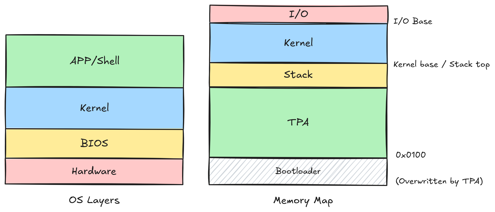
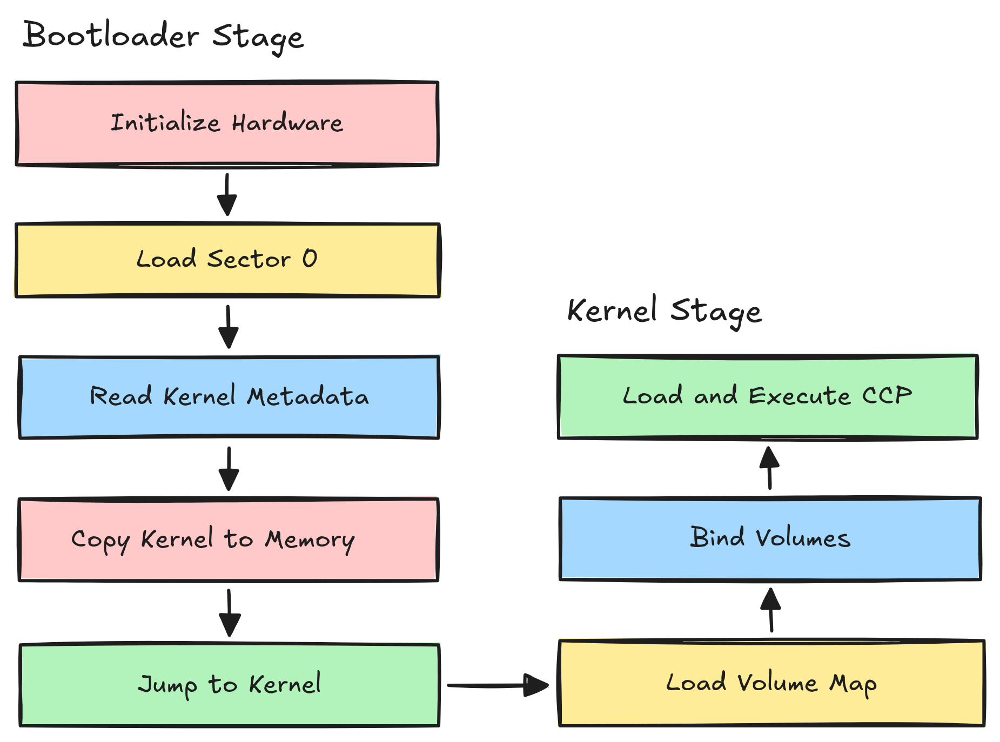

# Architecture

← [README](../README.md)

This page describes how CP/M Neo is laid out in memory, how it boots, and how its components are built.

## Layering & Memory Map

- The MMIO window base (`__io_base`) and the RAM base come from
  `platform/<name>/config.sh` (`IO_BASE`, `RAM_BASE`). The kernel is packed
  so it stays below `min(RAM_BASE + RAM_SIZE, IO_BASE)` and never touches the
  window.
- The TPA spans from `__tpa_base` (= `RAM_BASE + 0x100`) to the bottom of the
  kernel.

## Boot sequence

1. The bootloader calls `bios_init()` to initialize platform hardware, then
   reads sector 0 into a scratch buffer and verifies the `0xAA55` boot
   signature.
2. Reads the kernel load address and size from the sector-0 header (offsets in `core/kernel/s0_layout.h`).
3. It loads the kernel sectors into RAM and verifies the kernel magic, then
   jumps to the kernel entry point.

## Kernel startup

`os_entry()` (core/kernel/main.c) runs `kernel_init()`:

- `disk_init()`: reads the volume map (VMAP) from sector 1.
- Publishes the syscall table address into environment slot 0.
- Binds the mounted volumes (A:–D:); the first mount becomes the default drive.

It then prints the TPA size and calls `kexec_ccp()`, which loads the CCP into
the TPA and jumps to it. When a user program calls `sys_exit()`, the kernel
reloads the CCP and restarts the command loop.

## Syscalls

Applications reach the kernel through a function-pointer jump table. The kernel publishes the `SyscallTable` address in environment slot 0; syscall `N` lives at byte offset `N * 4` in the table (field order is the ABI: new syscalls may only be appended).

See [Syscall Reference](syscall-reference.md) for the full list.

## Shared stack

The kernel and user programs share a single stack at the boundary between the TPA and the kernel (`__kernel_base`) reserving 4 KB.

## Program entry and exit

A `.COM` binary is loaded at the TPA base (`__tpa_base`):

1. `arch/<isa>/crt0.S` sets the stack pointer and global pointer and zeroes
   `.bss`, then jumps to `_start`. The same crt0 is the entry point for the
   kernel, the CCP, and every user program.
2. `_start` (`sdk/src/start.c`) fetches arguments, calls `main(argc, argv)`,
   then calls `sys_exit()`, returning to the kernel which reloads the CCP.

## Building the OS

`sysgen new` runs `sysgen/build_disk.sh` with `--platform=<ID>`. The script
scans each `platform/*/config.sh` for an `ID=` equal to that argument to find
the platform's directory, then builds four components in order.

1. **Bootloader**: compiles the platform BIOS + `arch/<isa>/boot.S`, linked
   with `arch/<isa>/linker_boot.ld` into a `bootloader.bin`.
2. **Kernel**: a **two-pass link**:
   - Pass 1 links the kernel at a placeholder address to extract
     `__kernel_total` and `__kstack_guard` from the symbol table.
   - The real base `__KERN_START` is computed from
     `min(RAM_BASE + RAM_SIZE, IO_BASE) - __kernel_total - guard`, then
     pass 2 re-links with it, producing `kernel.bin`. The platform's
     `IO_BASE`, `RAM_BASE`, and the derived `__tpa_base`/`__mem_top` are
     supplied to both passes via `--defsym=`.
3. **SDK libc**: the user-space library, archived to `libc.a`.
4. **CCP**: linked like a user program (below).

Each build writes the platform id — the `ID=` field of
`platform/<folder>/config.sh`, required and 8 chars max — into sector 0
(`S0_PLATFORM`, 8 bytes at offset `0x01E`); the build fails if `ID` is
unset or exceeds 8 characters.

### Linking against the kernel

The CCP and user apps are linked with `--just-symbols=kernel.elf` plus the SDK
linker script (`sdk/linker/linker_sdk.ld`). This lets them resolve kernel
symbols such as `g_syscall_table`, `__kernel_base`, and `__tpa_base` without
embedding the kernel: the symbols resolve to whatever kernel is present at
runtime.

`sysgen install` uses the same mechanism via `sysgen/app_build.sh`.
